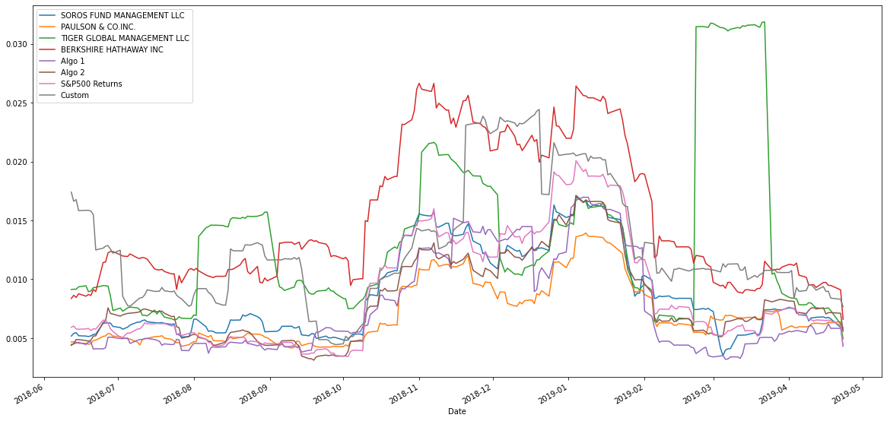

# portfolio-performance

This is a tool (analysis notebook) that analyzes and visualizes the major metrics of portfolios across all areas and determine which portfolio outperfoms the others. It utlizes quantitative analysis techniques with Python and Pandas and determines which portfolio is performing the best across multiple areas: volatility, returns, risk, and Sharpe ratios.

     <br>

## Table of Contents

1. [Project Links](#Project-Links)
1. [Contribution Guidelines](#Contribution-Guidelines)
1. [Project Team](#Project-Team)
1. [Questions](#Questions)
1. [License](#License)

## Project Links

[Repo Link](https://github.com/robel-codes/portfolio-performance) <br>


## Contribution Guidelines:

```
Feel free to contribute to this repo by creating issues or sending an email to any of the contributors in the list below.
```

## Project Team

[Robel Gebremeskel](https://github.com/robel-codes) <br>

## Questions

<details>
    <summary>Contact</summary>
    rofikre@yahoo.com <br>
</details>

## License

#### Distributed under the MIT License. See [Choose A License](https://choosealicense.com/) for more details.
